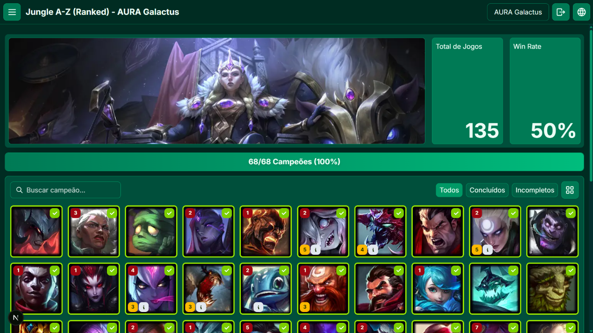

# LoL A-Z Tracker

Uma ferramenta para acompanhar desafios personalizados no League of Legends, registrar progresso de campeões, acompanhar estatísticas e comparar resultados através de ranking.

## 🎮 Sobre o projeto

O **LoL A-Z Tracker** foi criado com o objetivo de oferecer uma forma diferente de jogar League of Legends: focando na experiência de completar desafios e explorar campeões, não apenas em subir de elo.

A plataforma permite criar desafios personalizados, sincronizar partidas automaticamente e acompanhar o progresso de cada campeão durante a jornada.

## ✨ Funcionalidades

- Criação de desafios personalizados
- Sincronização automática de partidas através da Riot Games API
- Progresso individual por campeão
- Registro de vitórias e derrotas
- Histórico de desafios concluídos
- Ranking entre jogadores
- Estatísticas de progresso
- Controle de tempo jogado
- Avaliação de diversão dos campeões
- Comentários personalizados sobre experiências com campeões
- Interface responsiva para desktop e dispositivos móveis
- Suporte multilíngue:
  - Português (pt-BR)
  - Inglês (en)
  - Espanhol (es)

## 📸 Preview



## 🛠️ Tecnologias utilizadas

### Frontend

- Next.js
- TypeScript
- Tailwind CSS
- next-intl
- Tabler Icons

### Backend / Banco de dados

- Supabase
- PostgreSQL

### Integrações

- Riot Games API
- Data Dragon

## 🏗️ Arquitetura

O projeto utiliza uma arquitetura baseada em:

- Componentes reutilizáveis em React
- Server Components e Client Components do Next.js
- Autenticação baseada em sessão
- Banco PostgreSQL gerenciado pelo Supabase
- Integração com Riot Games API para sincronização de partidas

## 🚀 Executando localmente

### Pré-requisitos

Antes de começar, você precisa ter instalado:

- Node.js
- npm
- Conta no Supabase
- Conta Riot Developer para acesso à API

### Instalação

Clone o repositório:

```bash
git clone https://github.com/willian-pessoa/from-a-to-z.git
```

Entre na pasta:

```bash
cd from-a-to-z
```

Instale as dependências:

```bash
npm install
```

## 🔐 Variáveis de ambiente

Crie um arquivo `.env.local` baseado no `.env.example`:

```env
NEXT_PUBLIC_SUPABASE_URL=

NEXT_PUBLIC_SUPABASE_ANON_KEY=

SUPABASE_SERVICE_ROLE_KEY=

RIOT_API_KEY=
```

## 🗄️ Banco de dados

Crie um projeto no supabe e depois conecte ele via CLI do supabase e execute as migrations:

```bash
npx supabase db push
```

Caso queira dados fictícios para explorar a aplicação, execute o seed de desenvolvimento:

```bash
npm run seed:dev
```

## ▶️ Executando o projeto

Inicie o ambiente de desenvolvimento:

```bash
npm run dev
```

A aplicação estará disponível em:

```text
http://localhost:3000
```

## 🌎 Idiomas

O projeto possui suporte internacionalizado utilizando `next-intl`.

Idiomas disponíveis:

- 🇧🇷 Português
- 🇺🇸 Inglês
- 🇪🇸 Espanhol

## 🔗 Links

Aplicação:

https://seu-link.vercel.app

GitHub:

https://github.com/willian-pessoa/from-a-to-z

LinkedIn:

https://www.linkedin.com/in/willian-pessoa/

## 🎯 Objetivo do projeto

Este projeto foi desenvolvido como uma experiência prática envolvendo:

- Desenvolvimento Full Stack
- Integração com APIs externas
- Modelagem de banco de dados
- Autenticação
- Internacionalização
- Desenvolvimento de interfaces responsivas

## ⚠️ Riot Games API

O LoL A-Z Tracker utiliza dados disponibilizados pela Riot Games API.

Este projeto não é afiliado, patrocinado ou endossado pela Riot Games.

League of Legends e todos os seus conteúdos relacionados são propriedades da Riot Games.

## 🔒 Privacidade

O LoL A-Z Tracker respeita a privacidade dos usuários.

Para mais informações sobre coleta, armazenamento e utilização de dados, consulte a Política de Privacidade disponível na aplicação.

## 📄 Licença

Este projeto está disponível sob a licença MIT.
